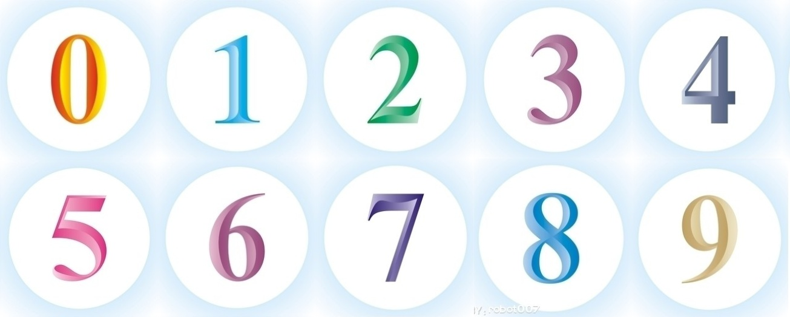
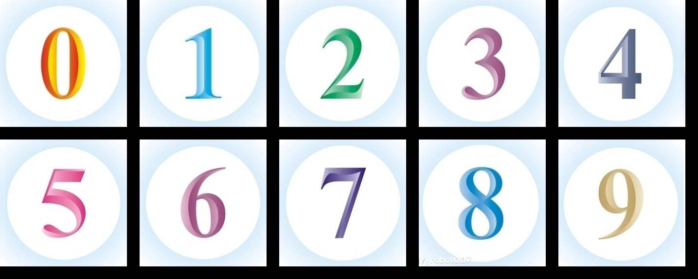
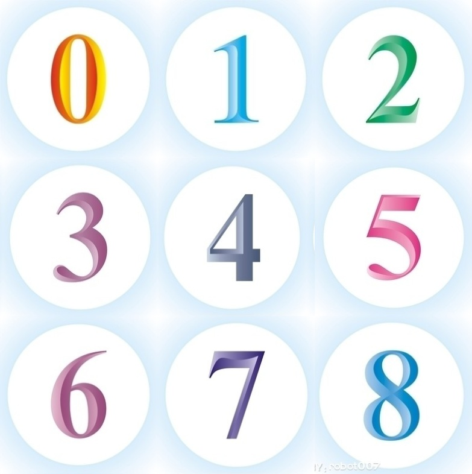

# ImageMerge

Provide a dictionary contains several images, row, every image scale (or padding), output merge result.
## parameters
```
path: Image source
save_path: Result saved path
col: col number

options:
padding_color: "white" | "black"
height_padding: percent of scale height
width_padding: percent of scale width
```
## How to use: examples


### 1. merge without padding

```python
from mergepic import merge

merge(path="src/", save_path="result_1.jpg", col=5)

```


result:

### 2. merge with padding
```python
from mergepic import merge

merge(path="src/", save_path="result_2.jpg", col=5, padding_color='black', height_padding=0.1, width_padding=0.1)

```

result:



### 3. merge 3x3
```python
from mergepic import merge

merge(path="src/", save_path="result_3.jpg", col=3)

```

result:

